# 🏥 Medical RAG Chatbot — End-to-End

An end-to-end **Retrieval-Augmented Generation (RAG)** chatbot for medical Q&A, built with LangChain, Pinecone, OpenAI GPT-4o, and Flask. Ask natural-language medical questions and get grounded, context-aware answers retrieved from your own medical PDF corpus.

---

## ✨ Features

- **Document ingestion pipeline** — loads and chunks medical PDFs automatically
- **Semantic vector search** — embeddings stored in a Pinecone serverless index (cosine similarity, top-k retrieval)
- **GPT-4o generation** — answers grounded in retrieved context via LangChain's retrieval chain
- **Lightweight HuggingFace embeddings** — uses `sentence-transformers` (384-dim) so no OpenAI embedding costs
- **Flask web UI** — simple, responsive chat interface served at `localhost:8080`
- **Modular source layout** — helper functions and system prompt cleanly separated under `src/`

---

## 🏗️ Architecture



---

## 📁 Project Structure

```
MEDICAL-RAG-E2E/
│
├── data/                          # Place your medical PDF files here
│
├── src/
│   ├── __init__.py
│   ├── helper.py                  # PDF loading, text splitting, HF embeddings
│   └── prompt.py                  # System prompt for the medical chatbot
│
├── research/                      # Jupyter notebooks for experimentation
│
├── templates/
│   └── chat.html                  # Chat UI (Jinja2 template)
│
├── static/                        # CSS / JS assets for the UI
│
├── app.py                         # Flask app — query pipeline & routes
├── store_index.py                 # One-time indexing script
├── requirements.txt
├── setup.py
└── template.sh                    # Shell script to scaffold the project structure
```

---

## ⚙️ Setup & Installation

### Prerequisites

- Python 3.9+
- A [Pinecone](https://www.pinecone.io/) account (free tier works)
- An [OpenAI](https://platform.openai.com/) API key

### 1. Clone the repository

```bash
git clone https://github.com/titan-exasaur/MEDICAL-RAG-E2E.git
cd MEDICAL-RAG-E2E
```

### 2. Create and activate a virtual environment

```bash
python -m venv venv
source venv/bin/activate        # On Windows: venv\Scripts\activate
```

### 3. Install dependencies

```bash
pip install -r requirements.txt
```

### 4. Configure environment variables

Create a `.env` file in the project root:

```env
PINECONE_API_KEY=your_pinecone_api_key_here
OPENAI_API_KEY=your_openai_api_key_here
```

### 5. Add your medical PDFs

Place your PDF files inside the `data/` directory:

```
data/
└── medical_book.pdf
└── pharmacology_guide.pdf
└── ...
```

---

## 🚀 Usage

### Step 1 — Build the Pinecone index (run once)

This script loads your PDFs, splits them into chunks, embeds them, and upserts everything into a Pinecone serverless index named `medical-chatbot`.

```bash
python store_index.py
```

> This only needs to be run once (or whenever your document corpus changes). The index persists in Pinecone.

### Step 2 — Start the chatbot

```bash
python app.py
```

The Flask server starts at `http://0.0.0.0:8080`. Open your browser and navigate to:

```
http://localhost:8080
```

You'll see a chat interface. Type any medical question and get a grounded answer based on your indexed documents.

---

## 🔧 Configuration

| Parameter | Location | Default | Description |
|-----------|----------|---------|-------------|
| `index_name` | `app.py`, `store_index.py` | `medical-chatbot` | Pinecone index name |
| `search_kwargs['k']` | `app.py` | `3` | Number of retrieved chunks |
| `model` | `app.py` | `gpt-4o` | OpenAI chat model |
| `dimension` | `store_index.py` | `384` | Embedding dimension (matches `sentence-transformers`) |
| `metric` | `store_index.py` | `cosine` | Vector similarity metric |
| `cloud / region` | `store_index.py` | `aws / us-east-1` | Pinecone serverless spec |

---

## 📦 Tech Stack

| Component | Library / Service |
|-----------|------------------|
| Orchestration | `langchain` 0.3.26 |
| LLM | OpenAI `gpt-4o` via `langchain-openai` |
| Embeddings | `sentence-transformers` (HuggingFace, 384-dim) |
| Vector Store | Pinecone Serverless via `langchain-pinecone` |
| PDF Parsing | `pypdf` |
| Web Framework | `flask` 3.1.1 |
| Env Management | `python-dotenv` |

---

## 🛠️ Development

### Running research notebooks

Exploratory notebooks live in `research/`. Launch Jupyter:

```bash
jupyter notebook research/
```

### Project scaffolding

The `template.sh` script recreates the project folder structure from scratch. Useful if you want to adapt the layout for a new domain.

```bash
bash template.sh
```

---

## ⚠️ Disclaimer

This chatbot is intended for **educational and informational purposes only**. It is **not** a substitute for professional medical advice, diagnosis, or treatment. Always consult a qualified healthcare professional for medical decisions.

---

## 📄 License

This project is open-source. See [LICENSE](LICENSE) for details.

---

## 🙏 Acknowledgements

- [LangChain](https://github.com/langchain-ai/langchain) for the RAG chain abstractions
- [Pinecone](https://www.pinecone.io/) for serverless vector storage
- [OpenAI](https://openai.com/) for GPT-4o
- [HuggingFace](https://huggingface.co/) for `sentence-transformers`
